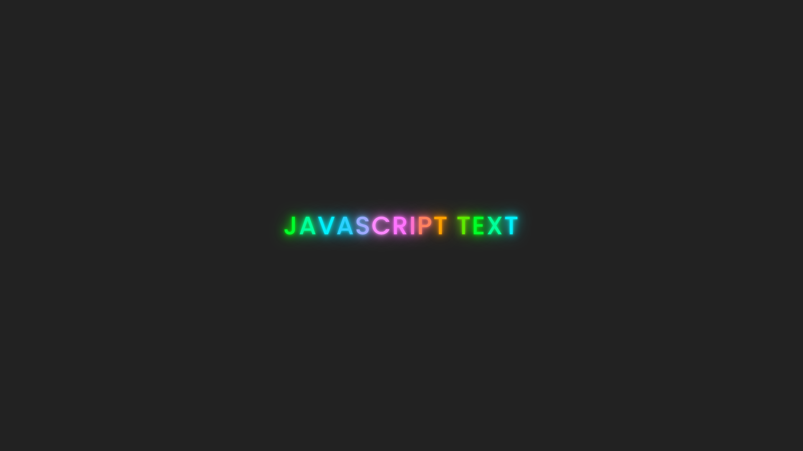

# ✨ Text Animation Effect with JavaScript  

A stylish **text animation effect** using **JavaScript, CSS, and HTML** that applies **dynamic letter-by-letter animations**, changing colors using `hue-rotate()` and adding a **neon glow hover effect**.

## 🚀 Features  
- **Letter-by-letter animation** with smooth transition delays.  
- **Dynamic color cycling** using `hue-rotate()`.  
- **Neon glow hover effect** for a futuristic look.  
- **Fully responsive design** for all screen sizes.  

## 🎨 How It Works  
### **JavaScript (app.js)**  
- The script **splits each letter** into a ``, applying **individual delays** for staggered animation.  

### **CSS (style.css)**  
- **`hue-rotate()`** applies a **color-changing animation** dynamically.  
- **`text-shadow`** creates a **neon glow effect**.  
- **Hover effect** intensifies the glow.  

---

## 🖼️ Demo Preview  
**Neon glow effect applied on hover:**  

git clone https://github.com/your-username/text-animation-effect.git

